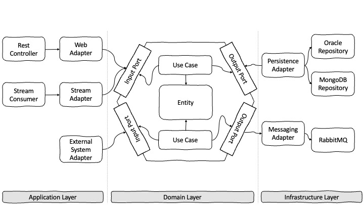

# Hexagonal Architecture



* The **application** is the side by witch the user or the external programs will interact with the application. There is the code that allows these interactions. The application drive the domain. 
* The **domain** is at the center of this architecture. It contains all the code that concerns and implements the business logic. The domain drive the infrastructure.
* The **infrastructure** is the part where we find the dependencies that the application needs to work.

The communication between application layer and infrastructure layer with the domain layer must be implemented always through the Input Ports and Output Ports. 

## Domain Layer
Domain Objects are the core parts of an application. These have the rules and validations defined by the business logic. 
Domain objects only will be changed when the business requirements will be changed.

### Entities
```kotlin
data class Item (
    val reference: Reference,
    val color: Color,
    val name: Name?
)

@JvmInline
value class Reference(value: String) {
    init {
        if(value.length != 8) {
            throw WrongReferenceException("Reference must have exactly 8 digits.")
        }
    }
}
```
### Use Case
A **use case** defines a concrete action that the domain allows to be used by the application layer.

```kotlin
interface GetItemUseCase {
    operator fun invoke(reference: Reference, colorCode: ColorCode): Item?
}

@Service
class GetItemUseCaseService(private val itemDBPort: ItemDBPort) : GetItemUseCase {
    override fun invoke(reference: Reference, colorCode: ColorCode): Item? {
        return itemDBPort.getItem(reference, colorCode)
    }
}
```

### Ports
A **port** is the way how domain defines how to work with it. Ports are implemented as Interfaces and there are two types:
* Input Ports: Lets the domain core to expose the functionality. Ex: GetItemUseCase --> Get an Item
* Output Ports: Lets the domain core to reach things outside of itself (like getting some data from a database)


```kotlin
interface ItemDBPort {
    fun getItem(reference: Reference, colorCode: ColorCode): Item?
}
```
## Application Layer
In order to accomplish the Single Responsibility principle we have the entry point where the action is being generated and an adapter that implements
the logic to adapt the response from Domain Layer.

```kotlin
@Controller
@RequestMapping("/api")
class ItemController (private val itemWebAdapter: ItemWebAdapter) {
    @ResponseStatus(HttpStatus.OK)
    @GetMapping("/item", produces = [MediaType.APPLICATION_JSON_VALUE])
    fun getItem(@RequestParam reference: String, @RequestParam color: String): ResponseEntity<ItemDTO?> {
        return itemWebAdapter.getItem(reference, color)
    }
}
```

```kotlin
@Component
class ItemWebAdapter(private val getItemUseCase: GetItemUseCase) {

    fun getItem(reference: String, colorCode: String): ResponseEntity<ItemDTO?> =
        getItemUseCase(
            reference = Reference(reference),
            colorCode = ColorCode(colorCode)
        )?.let { item ->
            ResponseEntity.ok(
                ItemDTO(
                    reference = item.reference.value,
                    color = item.color.colorCode.value,
                    name = item.name
                )
            )
        } ?: ResponseEntity.notFound().build()
}
```

In this layer we have also POJO classes to adapt the Domain response to the expected response by the client, configuration, etc...

```kotlin
data class ItemDTO (
    val reference: String,
    val color: String,
    val name: String?
)
```
## Infrastructure Layer
The infrastructure layer contains the logic needed to run the application.

As in Application layer, in order to accomplish the Single Responsibility principle we have Repository and an adapter that implements the output port and adapts the database information to 
the struct needed in Domain layer.

```kotlin
@Repository
interface ItemOracleRepository: JpaRepository<ProductStyleColorModel, Long> {
    @Query(
        """
        SELECT SC.*
        FROM CL_BF_PURCHASE_STYLECOLOR SC
        INNER JOIN CL_BF_PURCHASE_STYLE S ON SC.BF_PURCHASE_STYLE_ID = S.BF_PURCHASE_STYLE_ID
        WHERE S.BASE_COD_REFERENCE = :reference AND SC.COLOR_CODE = :color
        """,
        nativeQuery = true
    )
    fun getProductStyleColorByBaseReferencesColor(reference: String, color: String): List<ProductStyleColorModel>
}
```
```kotlin
@Component
class ItemDBPortAdapter(
    //TODO step8
    private val itemOracleRepository: ItemOracleRepository
): ItemDBPort {
    override fun getItem(reference: Reference, colorCode: ColorCode): Item? {
        return itemOracleRepository.getProductStyleColorByBaseReferencesColor(
            reference = reference.value,
            color = colorCode.value
        ).firstOrNull()?.toDomainModel()
    }
}
```